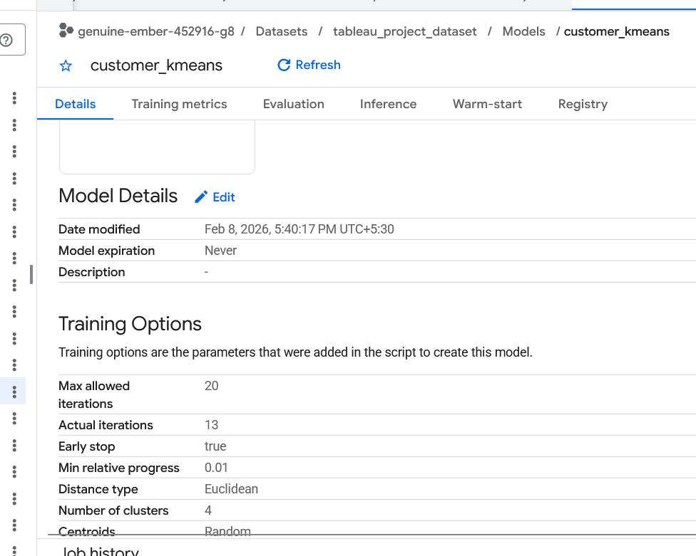
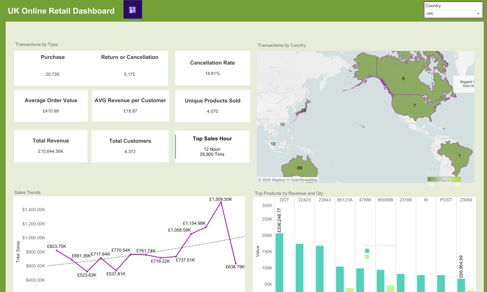
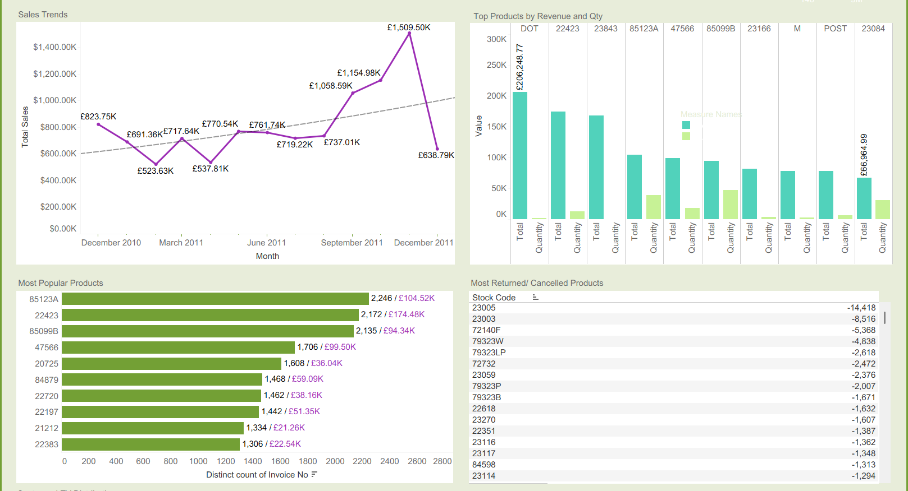
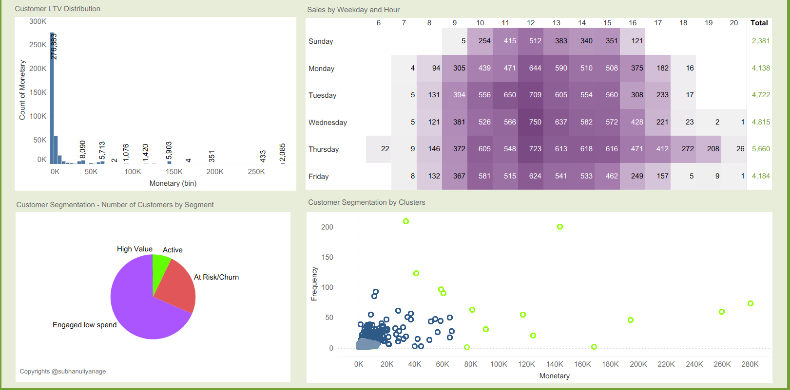

# UK Online Store - RFM Segmentations & Analysis using BigQuery & Tableau 

**Tech Stack**

The data source for this project is a real world dataset of all the transactions occurring between 01/12/2010 and 09/12/2011 for a UK-based and registered non-store online retail.The company mainly sells unique all-occasion gifts. Many customers of the company are wholesalers.

Dataset link from UCI ML Repository: https://archive.ics.uci.edu/dataset/352/online+retail

<b>Tableau Dashboard live here in Tableau Public 📊🔗</b>: https://public.tableau.com/views/uk_online_retail_dashboard/UKOnlineRetailDashboard?:language=en-US&publish=yes&:sid=&:redirect=auth&:display_count=n&:origin=viz_share_link

Data Fields Descriptions

| Column Name | Description                                                    | Data Type          | Additional Notes                                                    |
| ----------- | -------------------------------------------------------------- | ------------------ | ------------------------------------------------------------------- |
| InvoiceNo   | Invoice number uniquely assigned to each transaction           | Nominal            | 6-digit integer. If it starts with 'C', it indicates a cancellation |
| StockCode   | Product (item) code uniquely assigned to each distinct product | Nominal            | 5-digit integer                                                     |
| Description | Product (item) name                                            | Nominal            | Text description of the product                                     |
| Quantity    | Quantity of each product per transaction                       | Numeric            | Represents number of units purchased                                |
| InvoiceDate | Date and time when the transaction was generated               | Numeric (Datetime) | Contains both date and time                                         |
| UnitPrice   | Price per unit of the product in sterling                      | Numeric            | Currency value (GBP)                                                |
| CustomerID  | Unique identifier assigned to each customer                    | Nominal            | 5-digit integer                                                     |
| Country     | Country where the customer resides                             | Nominal            | Country name                                                        |

Total record Count - 541,909
For 135,080 records the customer id is null.

There are transactions where the quantity is negative. Most of those are cancellations which have the invoice no starting with C, but there are many others that still have negative quantities while having a regular invoice code. 

Another thing is that each of the records reprent an item bought. each record doesn't mean transaction

## Customer Segmentation in BigQuery

Feature generation for the Customer Segmentation
- number of transactions (frequency)
- Life time sales value(monetary)
- Average order value
- days passed since last transaction (recency)

BigQuery ML Was used to create model with the following features

Clusters Segmentation  - K-Means

Resultant Cluster Features

| Centroid Id | Count | Avg Order Value | Frequency | Monetary    | Recency Days | Behavior Classification    |
|-------------|-------|------------------|-----------|-------------|--------------|----------------------------|
| 1           | 14    | 13,467.89        | 76.86     | 123,755.83  | 29.36        | High-Value VIPs            |
| 2           | 1,056 | 312.92           | 1.55      | 475.42      | 249.14       | At-Risk/Churned            |
| 3           | 2,959 | 373.95           | 3.27      | 1,187.15    | 45.08        | Engaged Low-Spenders       |
| 4           | 310   | 589.49           | 17.75     | 9,053.15    | 15.59        | Active & Reliable          |

## Tableau Dashboard

Calculated fields created

- Total (Quantity*Unit price for transactions with positive quantities)
- Return or Cancellation or a purchase - (Transactions with negative quantities were identified as reutrns or cancellations)
- day of the week
- cancellation rate
- hour (Hour of transaction)
- Top hour (top hour with most txns)
- Segment Calc (Textal Descriptions for Clusters)

the product with the most amount of negative quantities is  TRAVEL CARD WALLET - I LOVE LONDON, a lot of it has been thrown away due to printing smudges.

Tableau Dashboard also incorporates created features at the customer level as well as the Segmented Clusters.

### Dashboard Preview

---
By [Subhanu](https://github.com/subhanu-dev) 🚀
